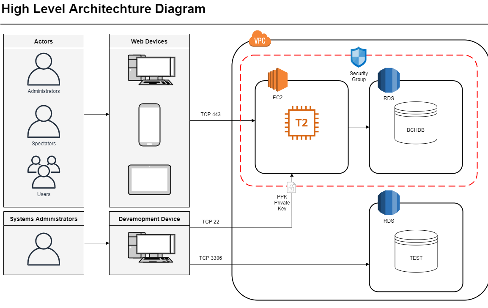
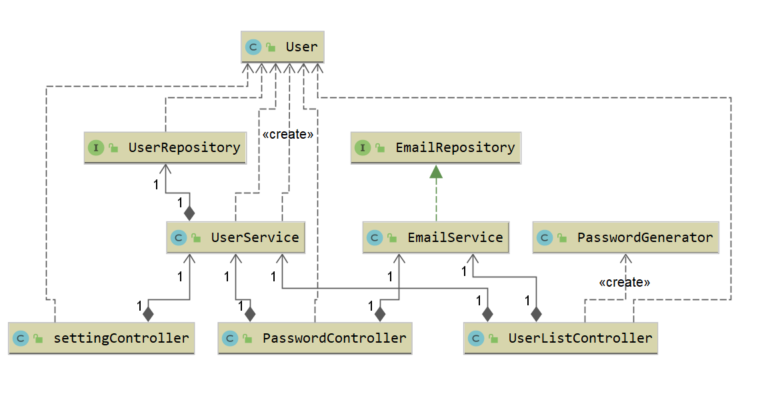
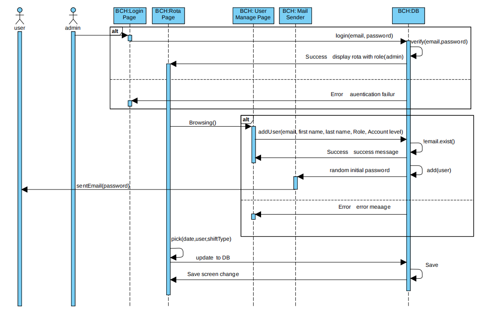

# OO Design and UML

Here we have a high level architecture diagram showing components of the project.  There are really two main sections to this, the users and interaction side and the AWS VPC (Virtual Private Cloud).  

The users are themselves split into those who interact with the application and then systems administrators who have different access in order to test and push new updates. The Actors can all access the web server through port 443 (HTTPS) via any web browsing device. The pages have however been primarily modelled for traditional computers over mobile devices so interaction may be more difficult otherwise.  

On the other side, we have the VPC. Within, there are two elements bundled together in a protected security group and a separate test database. The security group contains our web server, a T2 EC2 instance, as well as a MySQL RDS database named BCHDB. The security group itself allows us to easily set up simple access rules and protect our servers. As previously stated, the web server can be accessed on port 443 for encrypted web traffic, but it also has port 22 open for SSH control. This allows us as well as hospital systems administrators to launch new versions of the software to production. Protecting this however is of vital importance as leaving in vulnerable would give attackers complete access to our systems. For this reason, an SSH key known only to us is required. We will be handing this to our clients along with the project, however using a secure offline method e.g. handing over a USB stick with the .PPK file on it. Finally there is a separate test database, designed only to be used for development purposes as it does not have the same protections as the production one. It has an open port 3306 which allow free access of the contained data for debugging.  

---
## UML Diagrams

This static UML diagram models our password setting system.  
During the initial stages of our project, we did not encrypt passwords in our database. We obviously did not plan on doing this for production, it was simply easier to develop and debug our solution when everything was in plain text. When we got to the stage of implementation though, we thought it was a good idea to plan out when and where passwords would change within the system. We came up with 3:  
1. Initial account creation
2. Changing a password by choice
3. Forgetting a password  

These all had to be handled in a slightly different way and we wanted to tackle them by difficulty, easiest to hardest. We initially thought this would start with account creation, however modelling this revealed that we actually needed a working email reset system for it to actually be useable. For this reason we decided to instead start with the 'forgetting a password' case and made a settings menu that provides users with a way to change their passwords. After completing that we felt we had a better knowledge of the required systems and I believe that our future work on the other cases went smoother because of it. 

Here we have a dynamic model for the next stage, an email system that handles new account creation. It shows in more detail the interactions between different elements of our system. We used this to plan out what we needed to create and where it needed to be created, so we could effectively divide up the work and have different sections develop at different rates, but still have them work together once all the pieces are in place.  
We included details of our login system as we wanted to provide ourselves with some context of the current system. With this in place we could compare systems and draw parallels between them. 