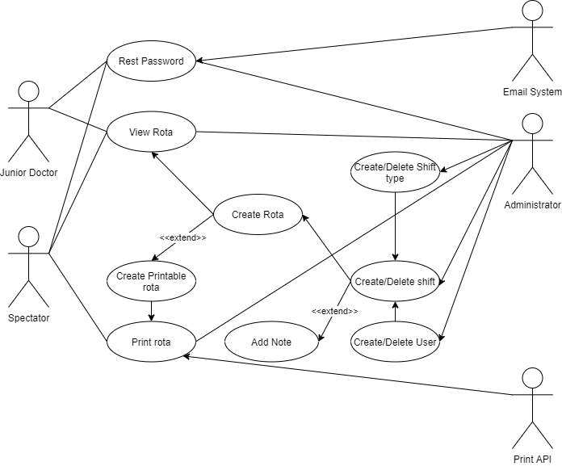

# Requirements

There are Nine stakeholder groups related to our rota system:

1. Administrators: These are the senior doctors of the department who are responsible for the rota and jobs surrounding it such as creating the rota, assigning shifts to all doctors, creating accounts for new staff, approving holiday requests and managing sick days.
2. Junior Doctors: The primary and most numerous users of the system will be junior doctors who predominantly want to view the shifts that have been assigned to them.
3. Spectators: Spectators are part of the admin team that assist with the day to day running of the hospital who do not need editing rights or to be on the rota but must be able to view it.
4. Patients: The patients at the hospital rely on the doctors being in the right place at the right time and so we need to take into consideration the effects they might feel if a system error causes confusion.
5. Other hospital departments: The has departments that each have specialisms that need to work together so we need to make sure that our solution fits in well with the hospital as a whole and should be wary of uprooting established practices.
6. Hospital IT team: The Hospital's in house IT team look after the hospital network and computers therefore we need to make it easy for them to take the application when we are finished with it.
7. The Hospital trust board: The trust board consists of 17 members who have corporate responsibility of running the hospital organization and will like features that ensure employment regulations are followed.
8. Potential employees: Doctors who are looking for a new job may want to consider the emergency department at BCH, however a factor for most people will be the tools they use day to day so we should consider the look and feel of our system.
9. The government and laws: We must be sure to follow the laws governing working hours and staffing requirements are strict in hospitals in order to ensure patients are seen by doctors who are in the right state of mind, as well as GDPR compliance.

## Use case diagram

## Flow steps for use cases

We have selected some individual use cases to expand on and explain in greater detail. In this section, an "_a_" will indicate an alternative flow and an "_e_" will indicate an exceptional flow:

As an Administrator it is important to be able to create and delete accounts so that they can react to staffing changes. The staff list in the department regularly will change as doctors leave and are hired into it. They need some way of adding a user to the timetable when that is necessary, but to safely delete them without running into errors if their shifts still show in the system.

## _Flow for adding a user:_

1. Enter administrator username and password
2. Navigate to user management page
3. Select add a user
4. Fill in the user's personal details
5. Select an authority level for the user
6. Select a role for the user
7. Select add user  
_e_. If the administrator has inputted the wrong details, the account should be edited or deleted - see flow for deleting a user, enter at step 4.
8. Select log out
9. Give temporary password to the new user and have them change it the first time they log in.
## _Flow for deleting a user:_  

1. Enter administrator username and password
2. Navigate to user management page
3. A list of users is presented to the administrator.
4. Select a user
5. Select delete user
6. Popup appears asking the admin to confirm their action   
_a1_. The user can select cancel to stop the action 
7. The user selects ok  
_a2_. If the user had shifts assigned to them, those are automatically found and deleted
8. The user is deleted from the database
9. Select logout  
 ---

As an administrator it is important to be able to assign a shift to a user so that they can create a rota. They will need to do this a lot so having quick methods to fill in a large section of the rota is important.

## _Flow for assigning a shift to a user (Creating a shift):_

1. Enter administrator username and password
2. The rota appears on the first page
3. Find the row for the desired day  
_a1_. The day may not be on this first page, so a button at the bottom can be selected to change the range of days shown
1. Find the column for the desired user  
_e1_. The user may not be on the rota yet so a new one should be added (see flow for adding a user)
1. Select the box at the intersection between these rows and columns.
2. Select the desired shift from the drop down box  
_a2_. The user can instead at this point type the shift code in instead of selecting it from the list  
_a3_. The user also has the option to paste in a shift or shifts from another box or boxes elsewhere on the rota sheet  
_e2_. If the desired shift is not there, the user must add one from the shift type page  
1. Select logout  
_a4_. Before logging out, they may want to add a note to the shift by right clicking the shift and selecting add comment.

## Requirements for assigning a shift to a user

We have broken down the flow for assigning a shift to a user even further, by picking out the functional and non-functional requirements that must be fulfilled.

### Functional Requirements

|ID|Focus|Requirement|
| :---: | --- | --- |
|   _1-0 Login_ | Users must be able to login | All users in the database with a username and password must be able to use their username and password to log in.  \[_Administrators, Spectators, Users_\] |
|   _1-1 Password choice_| Users can set their own passwords |   All users with valid logins must be able to set their password to a new chosen one (see requirement 3-1 for limitations). \[_Administrators, Spectators, Users_\] |
|   _2-0 Rota_ | The rota must display |   Upon login, all user must be able to see a full staff rota for the current month consisting of staff members, days and shifts.  \[_Administrators, Spectators, Users_\]|
|   _2-1 Notes_ | The rota must show notes |   On the rota screen, Administrators must be able to see notes attached to shifts by hovering over them.  \[_Administrators_\]|
|   _2-2 Note identification_ | Notes must be identifiable |   Within the rota screen, if a shift has an attached note then that shift should have one corner highlighted in an accent colour different to the primary colour of the shift.  \[_Administrators_\]|
|   _2-3 Note addition_ | Notes may be added |   Within the rota screen, a note may be added to a shift without a note by right clicking on the desired shift and selecting "add note".  \[_Administrators_\]|
|   _2-4 Note editing_ | Notes must be editable |   In the case that a note has already been added to a shift, an administrator may edit it by selecting the note bubble and changing the text.  \[_Administrators_\]|
|   _2-5 Shift adding_ | Shifts may be added |   It must be possible to add a shift to the rota on the rota page by selecting the cell at the intersection of the desired day and desired staff member and selecting the desired shift type from a given list.  \[_Administrators_\]|
|   _2-6 Shift copy/paste_ | Shifts may be copy/pasted |   It must be possible to add a shift or shifts to the rota on the rota page by selecting a cell or group of cells with the desired format and copying them with a keyboard shortcut, then pasting them in a new location.  \[_Administrators_\]|
|   _2-7 Shift text add_ | Shifts may be added via text | It must be possible to add a shift to the rota on the rota page by selecting the cell at the intersection of the desired day and desired staff member writing the shift code for the desired shift type.  \[_Administrators_\]|
|   _2-8 Save_ | Changes can be saved | Upon clicking the save changes button on the rota page, any changes that have been made to the rota must be saved back to the remote database, making them viewable by other users that then load the page.  \[_Administrators_\]|

### Non-Functional Requirements
|ID|Focus|Requirement|
| :---: | --- | --- |
|   _3-0 Username_ |       Username formatting  |    When a user is added, usernames must be formatted as a valid email address as this will also be used to contact the user in various circumstances  \[_Administrators_\] |
|   _3-1 Password limit_ |       Password formatting  |    Passwords must all contain at least 8 characters in order dissuade users from picking terrible passwords.  \[_Administrators, Spectators, Users_\] |
|   _3-2 Password store_ |       Safe password storage  |    Passwords must not at any time be stored in the database in plain text format. They instead must be hashed with a modern industry standard algorithm.  \[_System_\] |
|   _4-0 Perf-Load_ |       Rota load performance  |    From clicking the login button, a rota containing 15 shift types, 15 users and 100 shifts must load fully in under 4 seconds.  \[_Administrators, Spectators, Users_\] |
|   _4-1 Perf-Save_ |       Rota save performance  |    From clicking the save changes button, a rota containing 15 shift types, 15 users and 100 shifts including 10 new shifts, must save and reload fully in under 6 seconds.  \[_Administrators_\] |

